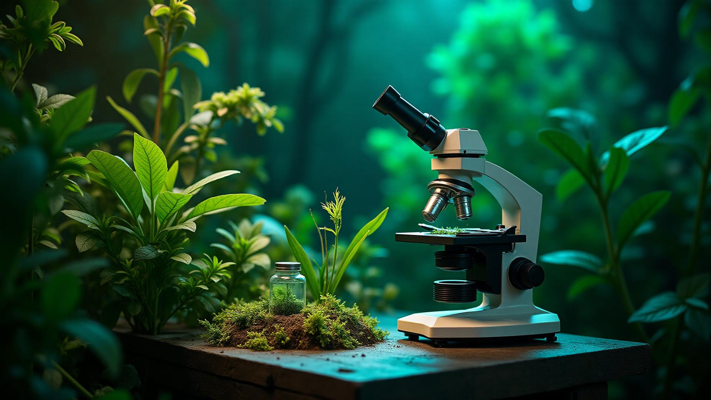

# BRAC University Natural Sciences Club (BUNSC)



A premium, interactive digital experience for the BRAC University Natural Sciences Club. This project bridges the gap between scientific curiosity and modern web design, featuring a "Living Field" 3D environment, organic minimalism, and a seamless user experience.

## 🌿 Project Vision

**"Where Ideas Take Root."**

This website serves as the digital headquarters for BUNSC, designed to:
- **Immerse** visitors in a "Living Field of Curiosity" (interactive 3D hero).
- **Showcase** the club's legacy through events, publications, and media.
- **Connect** inquisitive minds with the broader scientific community.

## 🛠 Tech Stack

Built with a focus on performance, aesthetics, and type safety.

- **Core**: [React 18](https://react.dev/), [TypeScript](https://www.typescriptlang.org/), [Vite](https://vitejs.dev/)
- **Styling**: [Tailwind CSS](https://tailwindcss.com/), [Shadcn UI](https://ui.shadcn.com/)
- **3D & Animation**: 
  - [React Three Fiber](https://docs.pmnd.rs/react-three-fiber) (Canvas management)
  - [@react-three/drei](https://github.com/pmndrs/drei) (3D helpers)
  - [Simplex Noise](https://github.com/jwagner/simplex-noise.js) (Organic particle motion)
  - [GSAP](https://gsap.com/) (High-performance cursor & micro-interactions)
- **Routing**: [React Router DOM](https://reactrouter.com/)
- **Icons**: [Lucide React](https://lucide.dev/)

## ✨ Key Features

### 1. The "Living Field" Hero
A custom 3D particle system (`src/components/LivingField.tsx`) that reacts to mouse movement.
- **Macro Elements**: Muddy brown pebbles/rocks.
- **Meso Elements**: Primary green spores.
- **Micro Elements**: Off-white dust/light motes.
- **Tech**: Uses `InstancedMesh` for rendering thousands of particles at 60fps.

### 2. Organic Design System
- **Palette**: Eucalyptus, Stone, Moss, and Sand.
- **Typography**: Clean sans-serifs paired with editorial serif accents.
- **Custom Cursor**: A dual-layer magnetic cursor (GSAP) that expands on interactive elements.

### 3. Interactive Components
- **Event Carousel**: Touch-friendly, swipe-enabled carousel with glassmorphism effects.
- **Media Gallery**: Masonry-style layout for club photography.
- **Publications**: Digital archive for the "BUNSC Scroll" and other writings.

## 📂 Project Structure

```bash
src/
├── assets/             # Images, videos, and static resources
├── components/         # Reusable UI components
│   ├── ui/             # Shadcn UI primitives (Button, Card, etc.)
│   ├── LivingField.tsx # 3D Particle System
│   ├── CustomCursor.tsx# GSAP Cursor
│   └── ...
├── pages/              # Route components (Home, About, Events...)
├── lib/                # Utilities (Tailwind merger, etc.)
└── App.tsx             # Main entry with Providers
```

## 🚀 Getting Started

### Prerequisites
- Node.js (v18 or higher)
- npm or bun

### Installation

1. **Clone the repository**
   ```bash
   git clone https://github.com/your-username/bucc-x-bunsc.git
   cd bucc-x-bunsc
   ```

2. **Install dependencies**
   ```bash
   npm install
   # or
   bun install
   ```

3. **Start the development server**
   ```bash
   npm run dev
   ```

4. **Build for production**
   ```bash
   npm run build
   ```

## 🎨 Customization

### Adjusting the 3D Field
Modify `src/components/LivingField.tsx`:
```typescript
const CONFIG = {
  colors: { ... }, // Update palette
  counts: { ... }, // Change particle density
  motion: { ... }  // Tweak speed and physics
};
```

### Theme Colors
Tailwind colors are defined in `src/index.css` using CSS variables (HSL format) and mapped in `tailwind.config.ts`.

## 🤝 Contribution

1. Fork the repository.
2. Create a feature branch (`git checkout -b feature/AmazingFeature`).
3. Commit your changes (`git commit -m 'Add some AmazingFeature'`).
4. Push to the branch (`git push origin feature/AmazingFeature`).
5. Open a Pull Request.

## 📄 License

Distributed under the MIT License. See `LICENSE` for more information.

---

*Built with 💚 by the BRAC University Computer Club (BUCC) for BUNSC.*


